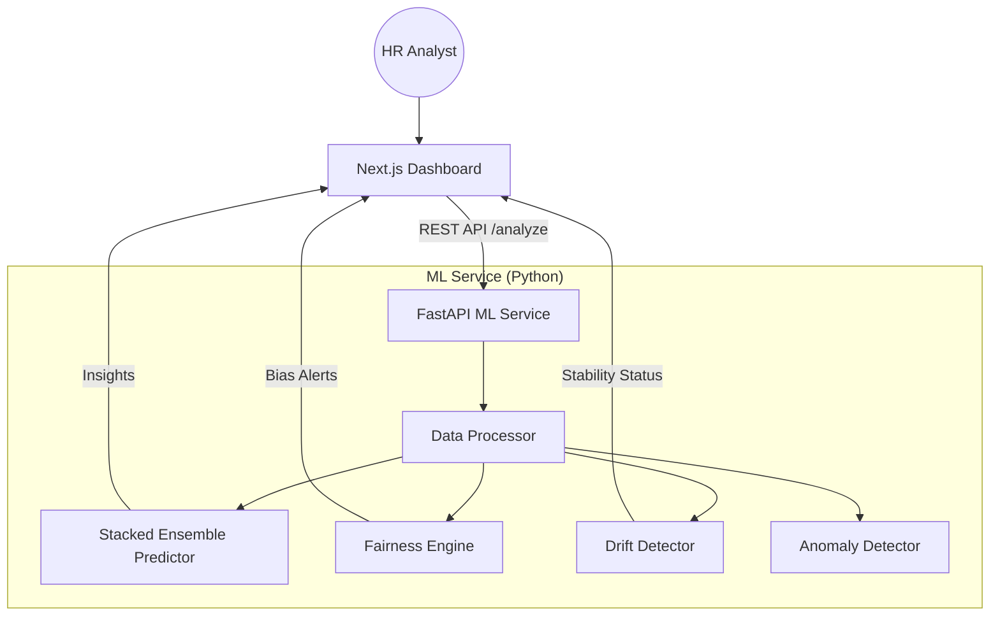

# 💼 Salary Insights: Decision Intelligence Platform

[](https://nextjs.org/)
[](https://fastapi.tiangolo.com/)
[](https://xgboost.readthedocs.io/)
[](https://www.typescriptlang.org/)
[](https://www.python.org/)

An enterprise-grade, **Decision Intelligence** platform that transforms raw salary data into strategic HR insights. Beyond simple accounting, Salary Insights uses sophisticated Machine Learning to ensure **pay parity**, detect **systemic drift**, and identify **anomalous spending** with high precision.

---

## � Technical USPs (The Competitive Edge)

### 1. Unified Fairness Engine
*   **Where**: `ml_service/fairness_engine.py` -> Integrated in `/analyze` endpoint.
*   **How**: Uses **Disparate Impact Analysis**. It calculates the ratio of average salaries between a protected group (Department) and the highest-paid group.
*   **USP**: Unlike standard dashboards, it doesn't just show data; it **mitigates bias** by generating a `Fair_Salary_Adjustment` recommendation to reach a target parity (default 90%).

### 2. Statistical Drift Monitoring
*   **Where**: `ml_service/drift_detector.py`.
*   **How**: Employs the **Kolmogorov-Smirnov (KS) Test** to compare the probability distribution of current uploads against a baseline.
*   **USP**: Prevents "Silent Failure." If the statistical nature of salary data shifts (e.g., due to inflation or market changes), the system alerts the user that the model baseline needs a reset.

### 3. Stacked Ensemble & Uncertainty
*   **Where**: `ml_service/predictor.py`.
*   **How**: A **Level-0 Ensemble** (Random Forest + XGBoost) feeds into a **Level-1 Meta-Learner** (ElasticNet).
*   **USP**: Includes **Quantile Regression** (using XGBoost's `quantileerror` objective). This provides a "Confidence Bound" rather than a single number, allowing HR to see the "Reasonable Range" of a salary.

### 4. Anomaly Intelligence
*   **Where**: `ml_service/anomaly_detector.py`.
*   **How**: Ensemble of **Isolation Forest** (Global outliers) and **Local Outlier Factor (LOF)** (Density-based local outliers).
*   **USP**: Detects subtle "Fat-Finger" errors or systemic overpayment that standard logic filters miss.

---

## 🧠 Machine Learning Breakdown

| Logic Area | ML Type | Algorithm Used | Purpose |
| :--- | :--- | :--- | :--- |
| **Salary Prediction** | Supervised | `Stacked Ensemble (RF + XGBoost)` | High-precision forecasting |
| **Uncertainty** | Supervised | `Quantile Regression` | 90% Confidence Intervals |
| **Meta-Learning** | Supervised | `ElasticNet` | Blending base models |
| **Anomaly Detection** | Unsupervised | `Isolation Forest` | Global outlier detection |
| **Cluster Anomaly** | Unsupervised | `Local Outlier Factor (LOF)` | Density-based drift detection |
| **Feature Drift** | Statistical | `Kolmogorov-Smirnov Test` | Model reliability monitoring |
| **Categorical Encoding** | Preprocessing | `Target Encoding` | Converting Dept names to numerical weights |

---

## 🎯 Business Use Case: "Annual Compensation Audit"

**The Problem**: A mid-sized tech company needs to perform an annual salary review for 500+ employees. Manually checking for pay gaps and market alignment is prone to error and bias.

**The Salary Insights Solution**:
1.  **Ingestion**: HR uploads the current salary CSV.
2.  **Detection**: The **Fairness Engine** flags that the "Marketing" department has a Parity Score of 72% compared to "Engineering," suggesting systemic bias.
3.  **Action**: The **Fair_Salary_Adjustment** column provides exact numbers to bring the parity back to 90% within the budget.
4.  **Verification**: The **Anomalies** section flags two employees receiving 300% more than their peers, revealing a manual data entry error.
5.  **Result**: The company completes a transparent, data-driven audit in minutes instead of weeks, with built-in protection against bias.

---

## 🏗️ Architecture

The platform leverages a modern **Microservices Architecture** to decouple the intensive ML computations from the interactive UI.



---

## 🛠️ Tech Stack

| Component | Technology | Role |
| :--- | :--- | :--- |
| **Frontend** | `Next.js 15`, `Tailwind CSS`, `Shadcn UI` | Modern, responsive dashboard |
| **Backend** | `FastAPI (Python)`, `Uvicorn` | High-performance ML API |
| **ML Engine** | `XGBoost`, `Scikit-Learn` | Core predictive & analytical logic |
| **Statistical** | `SciPy` | Distribution analysis & KS Testing |
| **Type Safety** | `TypeScript`, `Pydantic` | End-to-end data integrity |

---

## 🏁 Quick Start

### 1. Initial Setup
```bash
# Clone the repository
git clone https://github.com/jenaarmaan/Salary_Insights.git
cd Salary_Insights

# Install Frontend Dependencies
npm install
```

### 2. Configure ML Service
```bash
cd ml_service
python -m venv venv
source venv/bin/activate  # or .\venv\Scripts\activate on Windows
pip install -r requirements.txt
python main.py
```

### 3. Launch Frontend
```bash
# In the root directory
npm run dev
```

---

## 📊 Technical Deep Dive

- **Pay Parity Score**: Calculated as the mean Disparate Impact Ratio across all departments relative to the highest-paid group.
- **System Drift**: Specifically checks for **Feature Drift** by comparing current upload distributions against the historical baseline using the Kolmogorov-Smirnov test ($p < 0.05$ threshold).
- **Quantile Regression**: Unlike standard MSE regression, we optimize for `reg:quantileerror` to capture the 5th and 95th percentiles.

---

> [!IMPORTANT]
> This project is designed for **Decision Support**, not autonomous decision-making. Always verify fairness recommendations against internal HR policies.


