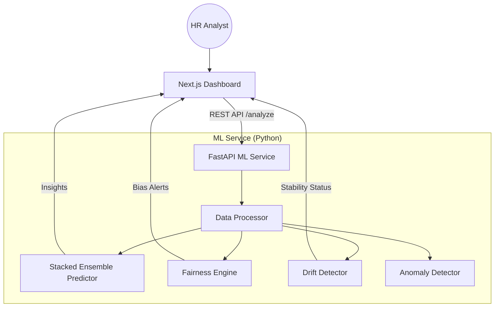

# 💼 Salary Insights: Decision Intelligence Platform

[](https://nextjs.org/)
[](https://fastapi.tiangolo.com/)
[](https://xgboost.readthedocs.io/)
[](https://www.typescriptlang.org/)
[](https://www.python.org/)

An enterprise-grade, **Decision Intelligence** platform that transforms raw salary data into strategic HR insights. Beyond simple accounting, Salary Insights uses sophisticated Machine Learning to ensure **pay parity**, detect **systemic drift**, and identify **anomalous spending** with high precision.

---

## 🚀 Core Capabilities

### 🧠 Predictive Intelligence
- **Stacked Ensemble Model**: Combines **Random Forest** and **XGBoost** with an **ElasticNet meta-learner** for state-of-the-art salary forecasting.
- **Uncertainty Estimation**: Uses **Quantile Regression** to provide **90% Confidence Intervals** for every prediction, quantifying financial risk.

### ⚖️ Fairness & Ethics (USP)
- **Fairness Engine**: Automated bias detection using **Disparate Impact Ratios**.
- **Parity Score**: Real-time health metrics to ensure equitable compensation across all departments.
- **Active Mitigation**: Generates "Fairness-Adjusted" salary recommendations.

### 🛡️ System Integrity
- **Drift Detection**: Monitors statistical shifts in salary distributions using the **Kolmogorov-Smirnov (KS) test**.
- **Anomaly Ensemble**: Dual-layered outlier detection using **Isolation Forest** and **Local Outlier Factor (LOF)**.

---

## 🏗️ Architecture

The platform leverages a modern **Microservices Architecture** to decouple the intensive ML computations from the interactive UI.



---

## 🛠️ Tech Stack

| Component | Technology | Role |
| :--- | :--- | :--- |
| **Frontend** | `Next.js 15`, `Tailwind CSS`, `Shadcn UI` | Modern, responsive dashboard |
| **Backend** | `FastAPI (Python)`, `Uvicorn` | High-performance ML API |
| **ML Engine** | `XGBoost`, `Scikit-Learn` | Core predictive & analytical logic |
| **Statistical** | `SciPy` | Distribution analysis & KS Testing |
| **Type Safety** | `TypeScript`, `Pydantic` | End-to-end data integrity |

---

## 🏁 Quick Start

### 1. Initial Setup
```bash
# Clone the repository
git clone https://github.com/jenaarmaan/Salary_Insights.git
cd Salary_Insights

# Install Frontend Dependencies
npm install
```

### 2. Configure ML Service
```bash
cd ml_service
python -m venv venv
source venv/bin/activate  # or .\venv\Scripts\activate on Windows
pip install -r requirements.txt
python main.py
```

### 3. Launch Frontend
```bash
# In the root directory
npm run dev
```

---

## 📊 Technical Deep Dive

- **Pay Parity Score**: Calculated as the mean Disparate Impact Ratio across all departments relative to the highest-paid group.
- **System Drift**: Specifically checks for **Feature Drift** by comparing current upload distributions against the historical baseline using the Kolmogorov-Smirnov test ($p < 0.05$ threshold).
- **Quantile Regression**: Unlike standard MSE regression, we optimize for `reg:quantileerror` to capture the 5th and 95th percentiles.

---

> [!IMPORTANT]
> This project is designed for **Decision Support**, not autonomous decision-making. Always verify fairness recommendations against internal HR policies.


